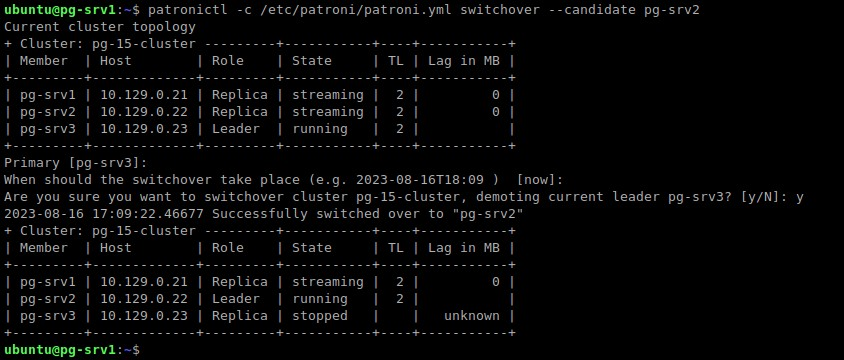
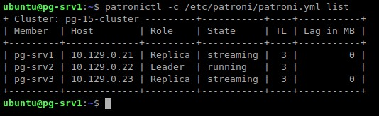

  <div align="center"><h2> 7. Проверка отказоусточивости при Switchover и Failsafe в Patroni </h2></div>

***
### Описание проверки:
  * У нас настроен отказоустойчивый кластер на базе `Patroni` и в случает отказа сервера с мастером (failsafe/switchover) должно быть переключение мастера на другой сервер.
  * В первом тесте мы вручную переключим мастер на другой сервер. Это будет имитация случая, когда надо отдать сервер на плановое обслуживание или ремонт.
  * Во втором тесте мы сэмулируем падение/отключение сервера с мастером. При этом мастер должен автоматически переехать на другой сервер. А когда упавший сервер вернется в работу - `Patroni` должен восстановить его в качестве реплики.

*** 
### Список ВМ с которыми идет взаимодействие на данном этапе
  :hammer_and_wrench: Название ВМ | :memo: Внутренний IPv4 |
  |--------------:|---------------|
  | **`pg-srv1`** | `10.129.0.21` |
  | **`pg-srv2`** | `10.129.0.22` |      
  | **`pg-srv3`** | `10.129.0.23` |
  
***

### Выполняем первый тест, где мы вручную переключим мастер на другой сервер. Это будет имитация случая, когда надо отдать сервер на плановое обслуживание или ремонт.
  * Фиксируем начальное положение сервера с мастером.
    ```bash
    patronictl -c /etc/patroni/patroni.yml list
    ```
    ```console
    ubuntu@pg-srv1:~$ patronictl -c /etc/patroni/patroni.yml list
    + Cluster: pg-15-cluster ---------+-----------+----+-----------+
    | Member  | Host        | Role    | State     | TL | Lag in MB |
    +---------+-------------+---------+-----------+----+-----------+
    | pg-srv1 | 10.129.0.21 | Replica | streaming |  2 |         0 |
    | pg-srv2 | 10.129.0.22 | Replica | streaming |  2 |         0 |
    | pg-srv3 | 10.129.0.23 | Leader  | running   |  2 |           |
    +---------+-------------+---------+-----------+----+-----------+
    ubuntu@pg-srv1:~$ 
    ```
    <kbd>
      
    </kbd>

  * :monocle_face: Мы видим, что мастер находится на `pg-srv3` и текущий `TL=2`

  * Переключим мастер на сервер `pg-srv2`.
    ```bash
      patronictl -c /etc/patroni/patroni.yml switchover --candidate pg-srv2
    ```
    ```console
    ubuntu@pg-srv1:~$ patronictl -c /etc/patroni/patroni.yml switchover --candidate pg-srv2
    Current cluster topology
    + Cluster: pg-15-cluster ---------+-----------+----+-----------+
    | Member  | Host        | Role    | State     | TL | Lag in MB |
    +---------+-------------+---------+-----------+----+-----------+
    | pg-srv1 | 10.129.0.21 | Replica | streaming |  2 |         0 |
    | pg-srv2 | 10.129.0.22 | Replica | streaming |  2 |         0 |
    | pg-srv3 | 10.129.0.23 | Leader  | running   |  2 |           |
    +---------+-------------+---------+-----------+----+-----------+
    Primary [pg-srv3]: 
    When should the switchover take place (e.g. 2023-08-16T18:09 )  [now]: 
    Are you sure you want to switchover cluster pg-15-cluster, demoting current leader pg-srv3? [y/N]: y
    2023-08-16 17:09:22.46677 Successfully switched over to "pg-srv2"
    + Cluster: pg-15-cluster ---------+-----------+----+-----------+
    | Member  | Host        | Role    | State     | TL | Lag in MB |
    +---------+-------------+---------+-----------+----+-----------+
    | pg-srv1 | 10.129.0.21 | Replica | streaming |  2 |         0 |
    | pg-srv2 | 10.129.0.22 | Leader  | running   |  2 |           |
    | pg-srv3 | 10.129.0.23 | Replica | stopped   |    |   unknown |
    +---------+-------------+---------+-----------+----+-----------+
    ubuntu@pg-srv1:~$ 
    ```
      <kbd>
        
      </kbd>

  * :monocle_face: Мы видим, что мастер переехал на `pg-srv2`, сменился `TL=3`, старый мастер `pg-srv3` стал репликой.


  * Проверим, что старый мастер стал репликой и не отстает. 
    ```bash
      ubuntu@pg-srv1:~$ patronictl -c /etc/patroni/patroni.yml list
    ```
    ```console
    ubuntu@pg-srv1:~$ patronictl -c /etc/patroni/patroni.yml list
    + Cluster: pg-15-cluster ---------+-----------+----+-----------+
    | Member  | Host        | Role    | State     | TL | Lag in MB |
    +---------+-------------+---------+-----------+----+-----------+
    | pg-srv1 | 10.129.0.21 | Replica | streaming |  3 |         0 |
    | pg-srv2 | 10.129.0.22 | Leader  | running   |  3 |           |
    | pg-srv3 | 10.129.0.23 | Replica | streaming |  3 |         0 |
    +---------+-------------+---------+-----------+----+-----------+
    ubuntu@pg-srv1:~$ 
    ```
      <kbd>
        
      </kbd>

  * :monocle_face: Мы видим, что `Lag in MB=0`


***
### Выполняем второй тест, где мы сэмулируем падение/отключение сервера с мастером. При этом мастер должен автоматически переехать на другой сервер. А когда упавший сервер вернется в работу - `Patroni` должен восстановить его в качестве реплики. 
  * Фиксируем начальное положение сервера с мастером.
    ```bash
    patronictl -c /etc/patroni/patroni.yml list
    ```
    ```console
    ubuntu@pg-srv1:~$ patronictl -c /etc/patroni/patroni.yml list
    + Cluster: pg-15-cluster ---------+-----------+----+-----------+
    | Member  | Host        | Role    | State     | TL | Lag in MB |
    +---------+-------------+---------+-----------+----+-----------+
    | pg-srv1 | 10.129.0.21 | Replica | streaming |  3 |         0 |
    | pg-srv2 | 10.129.0.22 | Leader  | running   |  3 |           |
    | pg-srv3 | 10.129.0.23 | Replica | streaming |  3 |         0 |
    +---------+-------------+---------+-----------+----+-----------+
    ubuntu@pg-srv1:~$ 
    ```
    <kbd>
      
    </kbd>

  * :monocle_face: Мы видим, что мастер находится на `pg-srv2` и текущий `TL=3`


***
### :+1: Проверка отказоусточивости при Switchover и Failsafe в Patroni пройдена!
