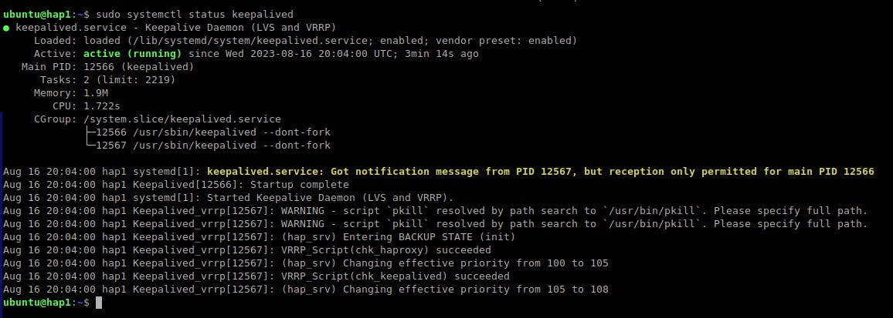
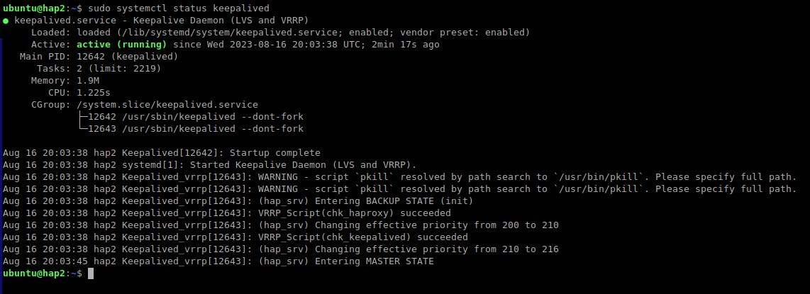
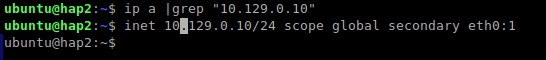
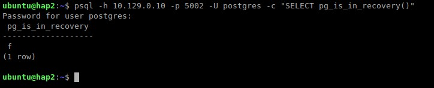
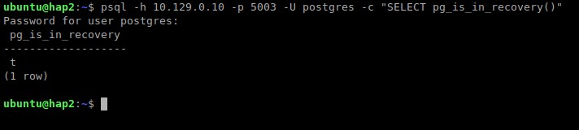

<div align="center"><h2> 8. Проверка отказоусточивости при падении HA Proxy и переносе VIP с помощью KeepAlived </h2></div>

***
### Напоминание реализации:
  * Мы помним, что пользователи подключаются к СУБД с помощью `HAProxy`, который работает через `VIP=10.129.0.10`, которым управляет `KeepAlived`
  * Наш `VIP=10.129.0.10` может перемещаться между серверами `hap1` и `hap2`, в зависимости от результатов проверок.
  * `HAProxy` является балансировщиком нагрузки и разделяет `ReadOnly` нагрузку через порт `5003` и `ReadWrite` нагрузку через порт `5002` т.е. перенаправляет подключения либо к мастеру, либо к реплике.

### Описание проверки:
  * При отказе одного из серверов `hap1` или `hap2` - `VIP=10.129.0.10` должен переехать на доступный сервер, тем самым обеспечить подключение новым пользователям без прекращения сервиса доступа к СУБД.
  * Мы будем эмулировать отключение сервера, на котором сейчас находится `VIP=10.129.0.10` и `status=MASTER` 

*** 
### Список ВМ с которыми идет взаимодействие на данном этапе
  :hammer_and_wrench: Название ВМ | :memo: Внутренний IPv4 |
  |--------------:|---------------|
  | **`hap1`** | `10.129.0.11` |
  | **`hap2`** | `10.129.0.12` |     
  | **`VIP`**  | `10.129.0.10` |
  
***
### Отключаем сервер, на котором сейчас находится `VIP=10.129.0.10` и `status=MASTER` 
  * Информация по серверу `hap1`
    ```bash
    sudo systemctl status keepalived
    ```
    ```console
    ubuntu@hap1:~$ sudo systemctl status keepalived
    ● keepalived.service - Keepalive Daemon (LVS and VRRP)
         Loaded: loaded (/lib/systemd/system/keepalived.service; enabled; vendor preset: enabled)
         Active: active (running) since Wed 2023-08-16 20:04:00 UTC; 1min 2s ago
       Main PID: 12566 (keepalived)
          Tasks: 2 (limit: 2219)
         Memory: 1.9M
            CPU: 569ms
         CGroup: /system.slice/keepalived.service
                 ├─12566 /usr/sbin/keepalived --dont-fork
                 └─12567 /usr/sbin/keepalived --dont-fork
    
    Aug 16 20:04:00 hap1 systemd[1]: keepalived.service: Got notification message from PID 12567, but reception only permitted for main PID 12566
    Aug 16 20:04:00 hap1 Keepalived[12566]: Startup complete
    Aug 16 20:04:00 hap1 systemd[1]: Started Keepalive Daemon (LVS and VRRP).
    Aug 16 20:04:00 hap1 Keepalived_vrrp[12567]: WARNING - script `pkill` resolved by path search to `/usr/bin/pkill`. Please specify full path.
    Aug 16 20:04:00 hap1 Keepalived_vrrp[12567]: WARNING - script `pkill` resolved by path search to `/usr/bin/pkill`. Please specify full path.
    Aug 16 20:04:00 hap1 Keepalived_vrrp[12567]: (hap_srv) Entering BACKUP STATE (init)
    Aug 16 20:04:00 hap1 Keepalived_vrrp[12567]: VRRP_Script(chk_haproxy) succeeded
    Aug 16 20:04:00 hap1 Keepalived_vrrp[12567]: (hap_srv) Changing effective priority from 100 to 105
    Aug 16 20:04:00 hap1 Keepalived_vrrp[12567]: VRRP_Script(chk_keepalived) succeeded
    Aug 16 20:04:00 hap1 Keepalived_vrrp[12567]: (hap_srv) Changing effective priority from 105 to 108
    ubuntu@hap1:~$ 
    ```
      <kbd>
        
      </kbd>

  * Информация по серверу `hap2`
    ```bash
    sudo systemctl status keepalived
    ```
    ```console
    ubuntu@hap2:~$ sudo systemctl status keepalived
    ● keepalived.service - Keepalive Daemon (LVS and VRRP)
         Loaded: loaded (/lib/systemd/system/keepalived.service; enabled; vendor preset: enabled)
         Active: active (running) since Wed 2023-08-16 20:03:38 UTC; 2min 17s ago
       Main PID: 12642 (keepalived)
          Tasks: 2 (limit: 2219)
         Memory: 1.9M
            CPU: 1.225s
         CGroup: /system.slice/keepalived.service
                 ├─12642 /usr/sbin/keepalived --dont-fork
                 └─12643 /usr/sbin/keepalived --dont-fork
    
    Aug 16 20:03:38 hap2 Keepalived[12642]: Startup complete
    Aug 16 20:03:38 hap2 systemd[1]: Started Keepalive Daemon (LVS and VRRP).
    Aug 16 20:03:38 hap2 Keepalived_vrrp[12643]: WARNING - script `pkill` resolved by path search to `/usr/bin/pkill`. Please specify full path.
    Aug 16 20:03:38 hap2 Keepalived_vrrp[12643]: WARNING - script `pkill` resolved by path search to `/usr/bin/pkill`. Please specify full path.
    Aug 16 20:03:38 hap2 Keepalived_vrrp[12643]: (hap_srv) Entering BACKUP STATE (init)
    Aug 16 20:03:38 hap2 Keepalived_vrrp[12643]: VRRP_Script(chk_haproxy) succeeded
    Aug 16 20:03:38 hap2 Keepalived_vrrp[12643]: (hap_srv) Changing effective priority from 200 to 210
    Aug 16 20:03:38 hap2 Keepalived_vrrp[12643]: VRRP_Script(chk_keepalived) succeeded
    Aug 16 20:03:38 hap2 Keepalived_vrrp[12643]: (hap_srv) Changing effective priority from 210 to 216
    Aug 16 20:03:45 hap2 Keepalived_vrrp[12643]: (hap_srv) Entering MASTER STATE
    ubuntu@hap2:~$ 
    ```
      <kbd>
        
      </kbd>

  * :monocle_face: Мы видим, что `state=MASTER` находится на сервере `hap2` и там же находится наш `VIP`
    ```bash
    ip a |grep "10.129.0.10"
    ```
    ```console
    ubuntu@hap2:~$ ip a |grep "10.129.0.10"
    ubuntu@hap2:~$ inet 10.129.0.10/24 scope global secondary eth0:1
    ubuntu@hap2:~$ 
    ```
      <kbd>
        
      </kbd>

  * Проверяем текущее подключение к мастеру
    ```bash
    psql -h 10.129.0.10 -p 5002 -U postgres -c "SELECT pg_is_in_recovery()"
    ```
    ```console
    ubuntu@hap2:~$ psql -h 10.129.0.10 -p 5002 -U postgres -c "SELECT pg_is_in_recovery()"
    Password for user postgres: 
     pg_is_in_recovery 
    -------------------
     f
    (1 row)
    
    ubuntu@hap2:~$ 
     ```
    <kbd>
      
    </kbd>

  * Проверяем текущее подключение к реплике
    ```bash
    psql -h 10.129.0.10 -p 5003 -U postgres -c "SELECT pg_is_in_recovery()"  
    ```
    ```console
    ubuntu@hap2:~$ psql -h 10.129.0.10 -p 5003 -U postgres -c "SELECT pg_is_in_recovery()"
    Password for user postgres: 
     pg_is_in_recovery 
    -------------------
     t
    (1 row)
    
    ubuntu@hap2:~$ 
    ```
    <kbd>
      
    </kbd>
    
***
### :+1: Проверка отказоусточивости при падении HA Proxy и переносе VIP с помощью KeepAlived пройдена!
