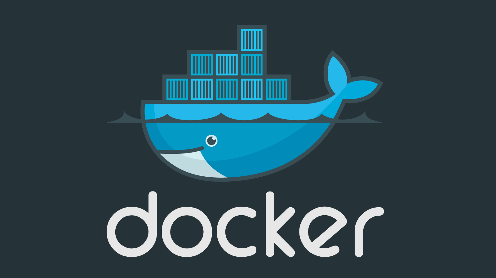

#### *Отчет о выполнении домашнего задания:*

> создать ВМ с Ubuntu 20.04/22.04 или развернуть докер любым удобным способом
1. **_Установлен Ubuntu server 22.04.2 на виртуальной машине в VirtualBox_**  

* поставить на нем Docker Engine
* сделать каталог /var/lib/postgres
* развернуть контейнер с PostgreSQL 15 смонтировав в него /var/lib/postgresql
* развернуть контейнер с клиентом postgres
* подключится из контейнера с клиентом к контейнеру с сервером и сделать
таблицу с парой строк
* подключится к контейнеру с сервером с ноутбука/компьютера извне инстансов GCP/ЯО/места установки докера
* удалить контейнер с сервером
* создать его заново
* подключится снова из контейнера с клиентом к контейнеру с сервером
* проверить, что данные остались на месте
* оставляйте в ЛК ДЗ комментарии что и как вы делали и как боролись с проблемами

И так:
1. **_Установлен Ubuntu server 22.04.2 на виртуальной машине в VirtualBox_**  
1. **_Установлен Postgres 15_**  
    * sudo apt update && sudo apt upgrade -y && sudo sh -c 'echo "deb http://apt.postgresql.org/pub/repos/apt $(lsb_release -cs)-pgdg main" > /etc/apt/sources.list.d/pgdg.list' && wget --quiet -O - https://www.postgresql.org/media/keys/ACCC4CF8.asc | sudo apt-key add - && sudo apt-get update && sudo apt-get -y install postgresql-15
1. **_Запуск psql из под пользователя postgres_**  
    * sudo -u postgres psql
1. **_Выключение auto commit_**  
    * \set AUTOCOMMIT OFF
1. **_Посмотреть текущий уровень изоляции show transaction isolation level_**  
    * read committed
1. **_Чтобы начать транзакцию, с текущем уровнем изоляции, надо выполнить_**  
    * begin;
1. > Начать новую транзакцию в обоих сессиях с дефолтным (не меняя) уровнем изоляции, в первой сессии добавить новую запись insert into persons(first_name, second_name) values('sergey', 'sergeev'); сделать select * from persons во второй сессии. > видите ли вы новую запись и если да то почему?  
    * Мы отключили AUTOCOMMIT и поэтому эта транзакция считается не зафиксированной, а работаем мы в read committed т.е. показываются все записи, которые уже зафиксированны (commit)
1. > завершить первую транзакцию - commit; сделать select * from persons во второй сессии видите ли вы новую запись и если да то почему? 
    * Новая запись появилась т.к. мы зафиксировали транзакцию (commit) т.к. работаем мы в read committed т.е. показываются все записи, которые уже зафиксированны (commit)
1. **_Начать новые транзации в repeatable read_**  
    * begin;
    * set transaction isolation level repeatable read;
    * или
    * begin transaction isolation level repeatable read;
1. > В первой сессии добавить новую запись insert into persons(first_name, second_name) values('sveta', 'svetova'); сделать select * from persons во второй сессии. видите ли вы новую запись и если да то почему?  
    * Новую запись мы не видим т.к. мы работаем мы в repeatable read. Это говорит о том, что в СУБД создан снимок данных на начало транзакции и мы будем видеть только те данные, которые есть, и не будем видеть новые(зафиксированные) данные. 
1. > Завершить первую транзакцию - commit; сделать select * from persons во второй сессии. видите ли вы новую запись и если да то почему?
    * Новую запись мы не видим т.к. мы работаем мы в repeatable read. Это говорит о том, что в СУБД создан снимок данных на начало транзакции и мы будем видеть только те данные, которые есть, и не будем видеть новые(зафиксированные) данные. 
1. > Завершить вторую транзакцию. сделать select * from persons во второй сессии. видите ли вы новую запись и если да то почему? 
    * Мы видим новую запись т.к. после фиксации транзакции мы переходим в уровень изоляции по умолчанию т.е. в read committed
    
<kbd>
  
</kbd>
